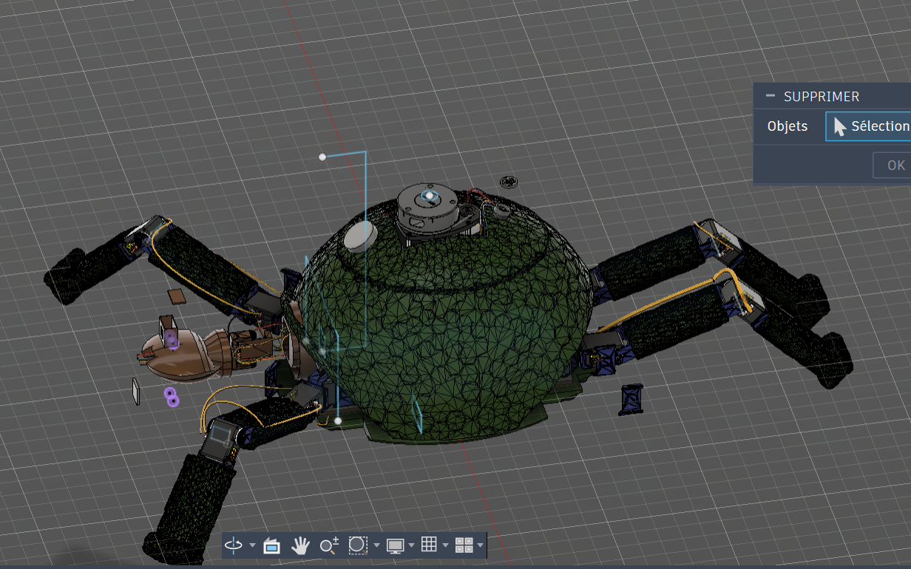

# my-first-hardware-robot-yaya
### i'm trying to build my first robot in hardware with 4 paw quite intelligent and that can recive order ! 

# what?
## the different state
  * navigation
  * tracking
  * manual
  * static
### navigation mode
__with this one you will need to use a phone to connect to the  website to the correct ip adress and the the map of the robot lidar will open. All you have to do is chose a point in the phone screen and then... IT WILL GOES TO THE POINT__

### tracking mode
__for the tracking mode you'ill also need a phone or any clickable-device and then the pov of the robot will appear! All you have to do is select the body shape you want to track and then it will follow it__ *educational purpose only*

### manual mode
__again you'ill need your phone or a device, to control the robot with joystick, it can control the motor of the head and the body__ *have fun*

### the static mode 
__what can i say more.... it's static__ *be sure he don't run away TT*

# the cad 
## state
__V1 quite messy will be improved__
not printed don't have any printer for now* 

# specification 
__for the robot i used container in linux with debian and i will use rclp to acces to the NAV2 ODOM and ROS__
__the robot name is nessie and all you have to do to change mode is to  say "nessie mode <mode>"__
*be carefull nessie prefer titanfall2 player to apex one's*
*if you're named anderson or cooper she will love u*
