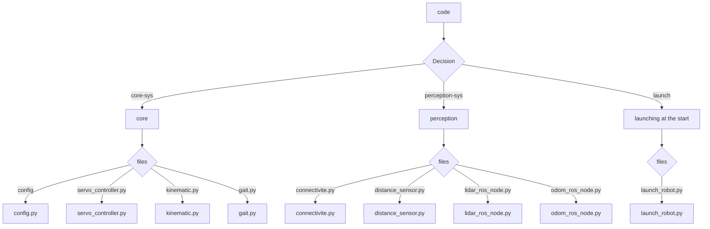

today is the first day of my project to build a real and intelligent robot wich i will add feature as i learn them
=
i'm starting by making like 2hour research to understand what i'm going to work on and then i buy fusion 360 with my school card
then i try to understand the app and start t make the first leg of my robot (chat gpt codex help me a bit to understand how i fusion 360 work ) so i pass over 1 hour starting doing it

we  are the 17/072026 03:03am 
=
!! i was doing research for the composant and i then i've make a exel file with the budget and the file to make my robot i take a raspberry pi 5 16gb because in the future i will add different features like facial reconnaisance or vocal and reponse to these and a panel of speakers distance control or autonom control i want to make a project that will last and when i learn smth i implemant it in this robot!!! 
so after likly 12h of research of material and founding i'm starting the 3d model on fusion360 hehehehe!

we are the 18/07/2026 02:09am 
=
today i have implemant from a 2h research some thing to use in the 3 model hole and make them last more with metal anbout
AND i found the camrera and understand that it need a special cable for raspberry PI 5. and then make different stage of the robot main chasis as the botom the batterie stability sensor and adaptator for batterie and the little buzzer the mid the RASPBERRY PI 5 and the WAVESHARE card 
for the to some sensors.
i'm starting disigning the paw using a 3d model on thing verse https://www.thingiverse.com/thing:7074577 because the motor i choose is not a regular so  to fix it to my robot i use specific support 
all of the 3d part take me 6h to make because i'm learning and adapting to fusion360 while making it so i'm a bit slow but with the time i will find out to be faster
tomorow i want to finish the paw and start the main box design and after the next day made start coding yeahhhh (i love coding and learning at the same time).


heyyyy 20/072026 03:02am also trying to fix his sleep schedule
=
improvement we're made!!!!!!!!!!!!!
i've start to see if someone neer from me (friend etc...) will buy me a little gadget i've made to help me provide funding for the project (everyone is supporting me but no one is buy TT i'm cooked) so then today i finish the bottom stare with all the anoying thing to do like  hole emplacement for the support.
i also add some stuff i will need to my long "thing to buy" list on exel i'm reaching 880euro need something like that!!! i don't know ref to have electronic stuff so maybe i don't take the right source or use the wrong thing (i hope i don't have to remake all the 3d model) 
i'm starting drawing the screen (head ) of the robot with piskel (VERYY USEFULL) 

to end i take the direction first to make a look, as bastion in OVERWATCH but then i remenber MY CHILDHOOD/FAVORITE/MOST EXTRODINARY ROBOT GAMES !! TITANFALL2!!!! SO I'm inspiring myself from BT7274 (the main character's robot/bro)

i'm trying to keep my motivation as i don't really love 3d designing it's very hard!! (but i love 2 drawing) i hope i'm not making all of this to finaly don't found the founding i need  

##### + 5hour  designing on my book the chasis with some dimension


starting the code !!! and also the bigest flop/fail of my life 22/07/2026
=
today i open instagram to see if anyone would buy my little key chain to help me buy the composant i need for my project (i even reduce the cost an the cost was very low like they nearly only paid the composant)  but no one show up !! NO ONE WOULD HELP ME CREATE THIS ROBOT i understand nowday it's hard to live in france TT (except ONE BRO THAT WANTED BUT I WANT TO MAKE HIM PAYS LESS AS HE SUPPORT ME EVERYTIME FOR ALL THING I MAKE IN MY LIFE!)
after this big fails i was quite down a little so i came back to my mail for hackclub and i think they don't see it or i do not make the right way the asking(i think that it because hackclub are a very great "nonprofit network"! 
and then i finally open vs code to boost my moral as i was quite low and thinking about if i was just dreaming 
and i start making the config.py with all the variable like port and id for the servomotor (i will need to configure them irl but now i can't buy the composant)
i also learn the 21/07 how to make kinematic_inverse for my robot paw mouvement so i passe like 3H understanding and visualizing the thing on my paper sheet andw with the help of claude ia that help me understand a bit to re-learn trigonometry things 
and finally write it in code kenematic.py and start the servo_controller.py with the declaration "import" and the opennign of the usb port and prevent from error or not closing  because claude teach me about the 

### try: """my code""" finally: """closing port"""

it's a python thing to make sure that even if i have a issue the port will close and it prevent from error when i will reopen "already open problem"
to end i learn how to make the files.py interconnect an create a DEF mouvement() to in the future make a gait.py and make my robot having a real walk 

the most difficult these days are VISUALISATION as i can't have the comoponent to help me see my progress or even i'm bad at understanding the "plan" like y,z or x,y  i'm very mediocre to visualize or organize the work and understanding the step i have to make 
these 2 day where filled with constant learning deception hope and desire to make big thing and learn thing 
(by the way as an athlete i'm coming back from an 3month injury and everything that was easy feel hard and i'm anxious about my alimentation when everything fall apart and how hard is it to came back. but i'm fuly  fill with outpassing my limit desire and dream from my old perf)
see you next day (tomorow i'm going to hang out with my bro at gym to renforce my knees and then i will continue working on that project)

#### total in hours about 3hour of coding research (just doc and logic forum) 
i didn't count the youtube video of course 
adding to 
and likely 4h research for composant ( not detail in the journal but i was screarching for adaptator,cables,sensor, and their 3d model


# 26/07/2026 2:14AM 
### __the best new i could have today!!!!__

##### i know it's been some day !! in fact i was in another project "a game for my friend" i'm making. so i take me some time but i recive a so great new that i finaly come back to my house .to work on this project


| the new is  | what am i doing in consequence |
| ------------- |:-------------:|
| hackclub respond to me !!      | so i read the mail like 4 time (i was very hppy)     |
| they tell me i can apply !  | so i read the requirement     |
| they said i need to give the design (wiring / 3D / material / pcb)      | so today i'm keeping the work on the model   |

#### First of all
i remenber i wanted to add a camera that will track body shape(or other).
So it need to be moving a bit, i finaly add in the project a new servomotor __but a litle one this time__ *a SG90* because it will only support the camera and support (i found it after 30min research because i wasn't having the diff between the one i use as paw and the SG90)

#### then 

###### i came back work on the visual of my robot ( the box that will cover the chasis)

__i start makig litle wall and make hole in the emplacement of the motor (took me 1HOURS because i still struggling with the 3D app)__ *to be sure they wont be blocked*

#### that all for today but don't worry i will came back total hour 5H30min 1h of constant crash of my pc 2h of hell strugle on fusion 2h pure happiness designing + 30 min for product research


# 02/08/2026 1:00pm 
### !!! __we're near from the end of designing__  !!!!!!
##### i know it's been  a week !! in fact i was so fucused to update and everytime i end the work of the day i were like 4am. I PASS OVER 20H working since last time!

### the PCB research and change
---------------

##### i recive another mail from stardance (hackclub) because i ask them so question and guidance. then they respond to me about my raspberry and said it was quit costfull (they are right!) so i make a research to found a less costfull but that still contain the power i need 
*i wasn't able to build my PCB because i need a lot of calculation power for the future litle llm i will put in*


| problem  | fuison 3d design changes |
| ------------- |:-------------:|
| raspberry model | new 3d box model | 
| buck converter only raspberry | changing for one with usb-c 5v| 
| i was using raspberry usb-a  | cable change usb-c to usb-c now|
| the heatsink and fan system|  new one with heat sink + fan (PCB very hot) | 

and other litle change on the price sheet. So the price went from 1000 to 700 and then 750 with the litle change 

*i don't know how to make it less costfull TT*

** to end with that i pass over 5 hour screaching the composant that are compatible and looking at the doc finding out that the pcb went very hot some time ( i choose the radxa 3w), during this time i also change the oled to make i bigger because i LOVE SCREEN WHERE I CAN DRAW ON 

_____________
### diagram and design

**the logic following step were making a wiring diagram and design for my robot** 

so i start my first use of "KICAD", i've make a litle diagram that help me organize the  wire connection.
##### i was battling agaisnt some problem of "were can i connect this cable" as some were 
- **_"usb-c"_** 
- other were **_"12awg"_** 
- or even **_"litle cable"_** 

##### i also got a problem with the usage of the space i have( i'm dysgraphic so quit complicated all the work i'm doing) as the schema was hard to understand so i pass a time to make it clear 

it all took me like 4 hour to understand how kicad work and do this litle design.

--------

### making the visual chasis and make this robot BEAUTIFULL (or not)

__i tink i've already start it last time but this yime i pass over 11h trying to make something (2day!)__ *to end by delete all the work*

- **i first make the front with holes and chamfer** i intend to make my robot look like a version 4 paw of 
[BT7274](https://www.google.com/search?sca_esv=f745035f8560aefd&rlz=1C1GCEA_frFR1170FR1170&sxsrf=APpeQnu7M_QMc_DzJvH4ZT4Qv5LLp270jg:1785438280740&udm=2&fbs=ABfTbFUDadgeu2mn4mYJ8iEZ1GUDDuwRa4um-2LNhBFWIpqZc3x8792U5ZVg9NxUywAiNAAK9LTph7mlss0iXxz9ohv5X4K06bW0PTrZtlKhUziN3xNuDBluxKmAlxWKdwzlp51FGvsHCD0r8xIGZIwYbnp3xsaIfLAm8cNnOJDz24qChps0X6nUQI7A8UmrQxfSItuiqSmzkbh_lvaJyRrOoUDvQ6dnvQ&q=bt7274&sa=X&ved=2ahUKEwj_sffzi_uVAxWfhv0HHYBnCQoQtKgLegQIERAB&biw=1280&bih=598&dpr=1.5) so i add a lot of detail but at the end ( 7h after) i found it to rectangular but. i pass so much time that i don't even wanted to come back so let it like that
 - **then the roof was the determinant of the delete canon event** as i was making the top i keep seeing this ugly rectangular font and sudenly i gave up( that not who i am normaly). *after 2h*

#### the second visual chasis canon event
__as i told you i'm dysgraphic so the second one was another fail__

- now my inspiration was the [seasme robot](https://www.google.com/search?q=seasme+robot&sca_esv=f745035f8560aefd&rlz=1C1GCEA_frFR1170FR1170&udm=2&biw=1280&bih=598&sxsrf=APpeQnuIOhkubGcRLw7zM4x-pHBNEq5AUg%3A1785437372807&ei=vJxravbzMIXZ7M8PjaOdyQI&ved=0ahUKEwj2wf_CiPuVAxWFLPsDHY1RJykQ4dUDCBE&uact=5&oq=seasme+robot&gs_lp=Egtnd3Mtd2l6LWltZxoCGAIiDHNlYXNtZSByb2JvdDIJEAAYgAQYExgKSK0_UMABWME-cAh4AJABAJgBrAKgAfMRqgEHNy44LjEuMbgBA8gBAPgBAZgCGaACzRXCAg0QABiABBiKBRhDGLEDwgIGEAAYBxgewgIKEAAYgAQYigUYQ8ICCBAAGIAEGLEDwgIHECMYyQIYJ8ICBRAAGIAEwgIHEAAYgAQYCsICCxAAGIAEGLEDGIMBwgIIEAAYgAQYiwPCAgoQABiABBgKGIsDwgIJEAAYgAQYChgLwgIMEAAYgAQYChgLGLEDmAMAiAYBkgcJMTAuMTMuMS4xoAf-SrIHCDIuMTMuMS4xuAeTFMIHCjAuMS40LjEyLjjIB_8CgAgB&sclient=gws-wiz-img#sv=CAMSXhoyKhBlLUhpQ1RtV3BHWHEtNFVNMg5IaUNUbVdwR1hxLTRVTToOb3dUbDYzN1MxbVR2V00gBCokCg5UeThheVBFcnZNa1pCTRIQZS1IaUNUbVdwR1hxLTRVTRgAMAEYByC2j8nQDUoIEAEYASABKAE) (like a cat)
- i started with the ears (i make 2 elipse and one triangle then extrude than dig the ears *took me 2h* )
- to end i just rotate the front and make a "filet" to make the chasis more round to the edge (30min approximative) 
- __finally__ i keep this model aside but i don't really like it yes again i fail! 

#### so i ask my friend for inspiration and help as lot of them are artist(i'm waiting for their response )
----
 that a lot for today  i hope i will soon be able to send all the schematic and start coding!!!!

# 06/08/2026 still working on robot chasis for near 15hour that i dev log on stardance now

### yess recently i text mail stardance as their hardware section work yippie !! and now i devlog on stardance !!

__but i'm not letting you down so here i make a resume of what i wirte in stardance__

#### *today i nearly finish the chasis*
### in fist place i've making the base of the chasis with a new idea of animal 
__i choose the turtle as i don't know why it pop on my head a random moment__
#### so i screach up for turtle image and do my best to make tyhe chasis in fusion!! *on the first part i just make the under look and a sphere( sketch > elipse > cut >revoltion) for the above and the head (i'm very proud) with enplacement for the motor that will turn the head, the camera above this one and the oled for look*

### in a second part !

##### i've working on how to put texture for 5hour i was screaching in all the fusion360 menu but it was a good result the triangle on my sphere were breaking the texture and multippling it so i ask google (as now in france it's new ot got an IA) and he gave me the name of this web site __*" Bump Mesh "*__

* i found the texture i want
* cut the back let space for the leg

  ## for the code

  ##### i've been removing the distance sensor as i don't tell you here (i forgot) but for efficiency i remplace by a lidar and i start also by coding it  but not the mapping and reaction to an object 


#### that all for these 15h because not a lot of change but a lot of research

# 11/08/2026 what a rought rush!
  ## to set the storyline clear this is the recap of dev log 3 AND 4 AND maybe 2  

### first of all the bad new...


**i lost 10h rec on lapse for stardance so i came for 20h dev log but only 10h regiter in stardance unfortunatly !!**

### the new

**i start the eyes animations !! i took an old project made on stardance *"my-first-keychain"* with basic animation and add new one like YES or NOT and the different state like _FOLLOW/ NAVIGATE/ STATIC/ MANUAL/_**

**then i also make a version with a turtle face only for the FOLLOW state of the robot.it took me a long time (i add ~130-140 frame to the original anim that got 60 i think don't truly remenber)**


### the GOOD NEW!! yippie (good ending)

###*i finish the 3d design* (for now)

**yes !! i fact i finish the 3d model i end with creating the cables in 3 making holes for them placing the lidar and the microphone for the vocal reconizing**

#### i finish the model PAW and add some texture for relief then i add them to the main part of the robot

## finaly my 3d model is done but if i have to learn thing:

* i need a better pc :-( ) as during the process i can't count the CRASH adn the LOST version only because of my pc making white screen and let me no solution after 1H wait to close the app 
* next time i will make 2 chasis a basic one think for the wire and a second that will make the look that goes over the 1st one 
  * as mine is quite messy i had problem to pass cable and some cable still visible (this will be for the 1.5 version of my project maybe)

* i can live and focus as these recent days i cannot live or go/hang out or even play video game/ shop food/ threw the garbage without keep think of the project. that maybe a sign that i have to organize more my work 

## for CODE
 
 *i've pass a long time learning the node pakage for ROS2 *
 ### in fact i use the NAV2/ SLAM in ROS pakage to make a real map and navigation system so it took me a lot of work to learning it!
 **but IA help me understand and do not just make the code (but i admit it HELP ME A LOT!!)**

so i make somepy files to calculate and make the robot navigate BUT i also just start to make the wifi connection check and have an impact on if the  robot use  IA by API or my LLM !

OKAY let try to make a graphic in markdown!




 __did i cook?__
 
*hell nah..*

see nex time I'm starting the CODE

# HEY THE CODE IS NEAR FROM THE END 15/08/2026 + 10H
## these day i've been work on the ai thing, the camera/map and the web page to control the robot

### to start THE IA "THING"(bruh)
*to remenber the last time the goal was to use gemini ai api when the robot is on wifi and LLM(local ia) ~3gb when he's offlline*
__SO first of all i ask "claude ia" (unfortunatly it's my 2nd hardware project so i don't how to use api and ia.
Then claude response me to check the google gemini doc and i make thing clear!__

#### but before start ia i have to make the  STT ( speach to text/vocal reconnizing) so i  found vosk and use a model that is near from bt7274 voice (a robot in a game btw)  and i code... don't how to explain but i fisrt of all make the robot react if i say his name "nessie" (from titanfall2 or apex) and then the program check if the next word are an order or not (`if mot is in ["left","right"]` a thing like that) and he react to these but then if it's a simple hello he give the text to gemini ia or my LLM  and then... then.... i remember i don't have vocal response so i had to the list a speaker and a amplifier and here we go to make some change in the 3d model en kidcad schema ! but now that we and this ! our robot can talk to you! 

### then the  camera and the map

__i start with the map using the last time work with the lidar to now allow the robot to move to a certains position by choosing on your device the location *see next in the web thing*
then i start the camera "tracking" by using a library called c2v and utralitics as it's way more easier so with these librairy it draw a rectangle around people shape and the camera follow one by using the in screen position of the click on the web and convert into angular and linear factor to "chase" (scary ouhhhh) the person__

#### with that i the litle sg90 motor i had: because if the person move to the side of the robot the time the robot take to turn he can no longer  follow the shape so to help the head move with the camera to have a more fluent tracking.

### TO END THE  WEB PAGE

#### i start by using the map the lidar is making and show it to the screen so it's all about passing list thought node then python then html with flask then i handle the click with js and it send the click pos to the robot and he goes (that not that magic it a lot of litle thing behind TT) and i also make the camera track same as the map but now it show the camera preview of the robot and make boxes around body-shape and then.. i handle the click to follow this one by checking image by image the deplacement of the center of this box. all of this by using route like:  
```
@app.route('/carte')
def envoyer_carte():
    image = generer_image_carte()
    buffer = io.BytesIO()
    image.save(buffer, format='PNG')
    buffer.seek(0)
    return send_file(buffer, mimetype='image/png')

@app.route('/')
def page_html():
    return render_template('index.html')
@app.route('/camera')
def envoyer_camera():
    if camera.personne_detectee is None:
        return "no one in the zone yet"
    image_annotee = camera.personne_detectee[0].plot()
    succes , buffer_encode = cv2.imencode('.png' , image_annotee)
    return send_file(io.BytesIO(buffer_encode) , mimetype='image/png')

@app.route('/choisir_personne', methods=['POST'])
def choisir_personne():
    donnees = request.json
    click_x = donnees['x']
    click_y = donnees['y']
    for boite in camera.personne_detectee[0].boxes:
        x_min, y_min, x_max, y_max = boite.xyxy[0]
        if x_min <= click_x <= x_max and y_min <= click_y <= y_max:
            camera.cible_x = (x_max + x_min) / 2
            camera.cible_y = (y_min + y_max)  / 2
        return "ok"

@app.route('/manual', methods=['POST'])
def recevoir_manual():
    donnees = request.json
    state.manual_angular_y = donnees['dx']
    state.manual_linear_x = donnees['dy']
    return "ok"

@app.route('/manual_camera', methods=['POST'])
def recevoir_manual_camera():
    donnees = request.json
    state.camera_angular_z = donnees['dx']
    return "ok"

@app.route('/objectif', methods=['POST'])
def recevoir_objectif():
    donnees = request.json
    x = donnees['x']
    y = donnees['y']
    x_real = derniere_carte.info.origin.position.x + x *  derniere_carte.info.resolution
    y_real = derniere_carte.info.origin.position.y + y *  derniere_carte.info.resolution
    goal_msg = NavigateToPose.Goal()
    goal_msg.pose.header.frame_id = 'map'
    goal_msg.pose.pose.position.x = x_real
    goal_msg.pose.pose.position.y = y_real
    goal_msg.pose.pose.orientation.w = 1.0
    carte.action_client.send_goal_async(goal_msg)
    return "ok"
```
#### and for the next thing about web it's the manual system so i use add eventlistenner and by tracking the move-distance of the "joystick" i relate it in the code and then apply it the robot mouvement!

### for the next step!!!
__i'm starting the stability sensor and claude help me with geometry like COS SIN TAN i know it's thebasic but i have some struggle with these even tho i have a great normal level in math__

* after that
 * the js click to change the state
 * the vocal ability to change the state
 * the use of the oled screen to show the state or even allow ia to control by draw an use them depending on the interaction
 * verify every litle part of the code i connected
* if i have the will to do it or maybe in a v2
 * maybe a V2 the ability to walk thought stairs
 * maybe some emote

## i want to end by tell the ia use in my project :
 ## you all know about te ia geminie and llm but i talk about claude use i really want to show the details of the project and how a total begennier came to do that and yes i use claude like a teacher and if you want to use ia i can only give you the advice to not use it to make the code... tell it how it work? why did you tell me that? can you bring me the doc? i know it's even better if we don't use ia but as total begennier this project would take me years instead of month when i use ia so to know i use ia to understand new thing  like all along this project i'm learning : linux/ROS/NAV/VOSK/FLASK/NODE/JSON/PYTHON/DEBIAN_OS/CONTAINERS/BASIC ELECTRONIC CIRCUIT/ A TONS OF LIBRAIRY/ ODOMETRY/LIDAR USE/ROUTE/TRYGONOMETRY/KICAD/FUSION360 and to learn all of that claude i a great way to help me navigate thought these subject! 
 ## that all for today i hope you're having a nice day and enjoy following me see you next time!

 # 16/08/2026 1 pm
 # I GUESS IT THE END OF THE BEGINNING !!
 ### i have finish all the work a i can for NOW
 __i said for now because some litle part of code are commentary as i can do them without the exact material__
 ### but for now i'm ready to send my work to stardance!!!!! (yippie i run a hight elevated hill to celebrate :) 11km in 1H14 with 330m of elevation (the elevation of the tour eiffel in france i'm literaly flexing that ridiculous TT)

 ## so to came here yesterday i finish some little thing!
 ### the oled display animating depending the state or anything like that
 **using the state_machine.py and i had a litle easter egg if you says "nessie mode turtle she will display the same animation but a face more like a turtle than just eyes**
 ### i handle the changing state with the voice
 **include a check in the vocal order if there is the name of an state**
 ### i make the js button and the s css 
 **this was literaly a chill part as i know the most js (i make some games in js) so i make a header with the date and time and also a shutdown button that will instantly cut the robot to off (using fetch --> app.route ) and i also make the left columns to chose your mode with button**
 ### check if every piece of the code is correctly launch/use/call 
 **because i found out some of them wasn't launch and even set a varible so i re check all my code but now it seem set to go**

 ## i'm stoping here and i'm going to make a video to submit my final schematic and code to stardance SO NOW IT'S TIME FOR THE SHOW!!!! see you around  and thank to come this far in my journey <3


 # TOTAL HOUR PASS 127h and 24min aproximatvely (youtube video and other not coutable thing doesn't take place in the finaly hour pass
